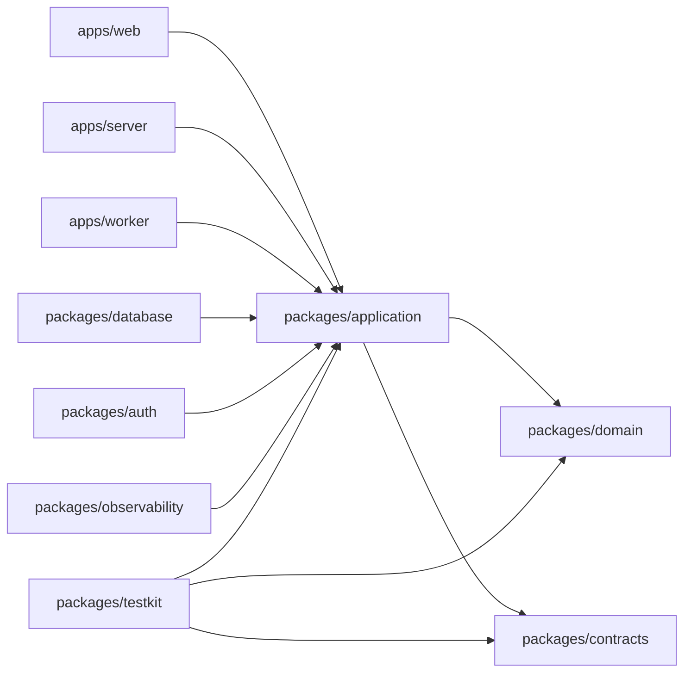

# Reglas de dependencia

## Regla de dirección

| Módulo                                            | Puede depender de                              | No puede depender de                                                    |
| ------------------------------------------------- | ---------------------------------------------- | ----------------------------------------------------------------------- |
| `domain`                                          | TypeScript y utilidades puras                  | aplicación, contratos HTTP, base de datos, frameworks, proveedores o UI |
| `application`                                     | `domain` y puertos definidos localmente        | Fastify, Next.js, Kysely, Redis, S3, OIDC o UI                          |
| `contracts`                                       | Zod y tipos de transporte                      | dominio, aplicación, ORM o adaptadores                                  |
| Adaptadores (`database`, `auth`, `observability`) | aplicación, dominio y contratos                | `web`, `server` u otro adaptador concreto                               |
| Aplicaciones                                      | aplicación, contratos y adaptadores necesarios | acceso directo a reglas internas de otro proceso                        |
| `ui`                                              | React y tokens de diseño                       | aplicación, autorización o entidades persistentes                       |
| `testkit`                                         | dominio, aplicación y contratos                | datos reales, secretos o infraestructura compartida                     |

`pnpm architecture:check` valida los imports entre paquetes de workspace y
forma parte de `pnpm verify`, por lo que también se ejecuta en CI. La primera
implementación no puede introducir una excepción silenciosa: una nueva
dirección de dependencia requiere ADR y debe figurar explícitamente en el
validador. La excepción actual está documentada en ADR 0007.
